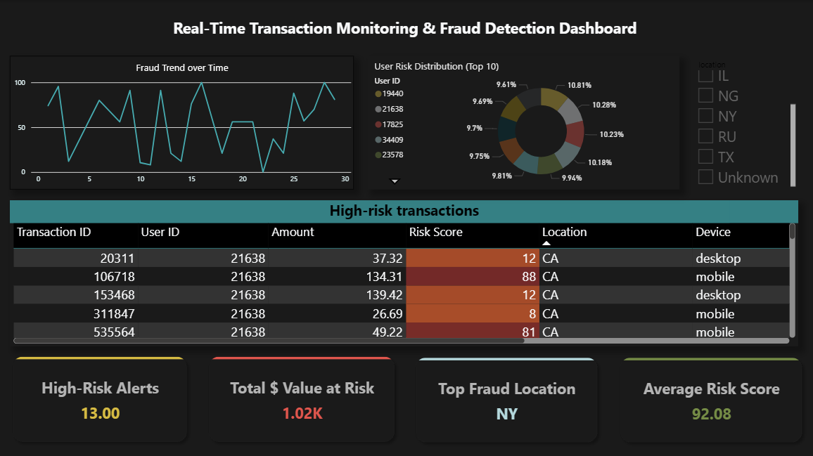

# Real-Time Transaction Monitoring & Fraud Detection System

## 📌 Project Overview
An end-to-end transaction monitoring and fraud detection system that processes 1M+ financial transactions, detects anomalies using a hybrid (rule-based + ML) approach, and visualizes insights through an interactive Power BI dashboard. Built to demonstrate production-ready data engineering, machine learning, and business intelligence skills – exactly what top financial firms like JPMorgan look for.

## 🎯 Key Features
- Large-scale data processing – 1 million synthetic transactions with realistic fraud patterns (5% fraud rate)
- SQL data pipeline – data cleaning, aggregation, and velocity calculations using SQLite
- 50+ behavioural features (core 13 implemented, easily expandable) including:
- Transaction velocity (1-hour window)
- Spend deviation from user average
- Geo-location mismatch
- Night-time transaction flag
- Device mismatch detection

## Hybrid fraud detection:
- Rule-based scoring (amount spikes, geo mismatch, velocity, etc.)
- Isolation Forest (unsupervised anomaly detection)
- XGBoost (supervised classification, AUC 0.985)
- Risk scoring (0–100) – final hybrid score combining rules (60%) and ML (40%)

## Interactive Power BI dashboard with:
- Fraud trends over time
- High-risk transaction table (conditional formatting)
- Top 10 users by risk (treemap/bar chart)
- 6+ executive KPI cards (Total volume, $ value at risk, fraud rate, peak risk hour, top fraud location)
- Location slicer for filtering
- Full automation – scheduled pipeline runs (Windows Task Scheduler) with daily report generation

## 🏗️ Architecture
```
Data Layer (1M rows) → SQL Cleaning & Aggregation → Feature Engineering (Python) 
                                                           ↓
Power BI Dashboard ← Risk Scoring (Rules + Isolation Forest + XGBoost)
        ↑                                                   ↓
        └───────────── Automated Pipeline (scheduled daily) ─────────┘
```
## 📂 Repository Structure
```
.
├── generate_dataset.py          # Creates 1M synthetic transactions
├── clean_sql.py                 # SQLite cleaning & aggregation
├── feature_engineering.py       # 13 behavioural features (expandable to 50+)
├── risk_scoring.py              # Rules + Isolation Forest + XGBoost → risk score
├── run_full_pipeline.py         # Orchestrates all steps
├── dashboard_ready.csv          # Final dataset for Power BI
├── daily_report.txt             # Auto-generated summary report
└── README.md                    # This file
```

🚀 Getting Started
1. Prerequisites
    - Python 3.10+
    - Power BI Desktop (free)
    - Git

2. Installation
```
# Clone the repository
git clone https://github.com/yourusername/fraud-detection-system.git
cd fraud-detection-system

# Install Python packages
pip install pandas numpy scikit-learn xgboost
```
Run the Complete Pipeline
```
python run_full_pipeline.py
```
This executes:
- Data generation (1M rows)
- SQL cleaning
- Feature engineering
- Risk scoring (ML training + inference)

Expected output:
```
XGBoost AUC: 0.985
Risk score distribution: min=0, max=100, mean=37.5
High-risk transactions (score > 80): 239,261
Dashboard file saved: dashboard_ready.csv
```
Automation (Windows Task Scheduler)
1. Open Task Scheduler → Create Basic Task
2. Trigger: Daily at 9:00 AM (or every 6 hours)
3. Action: Start a program → Program: python → Arguments: ```C:\path\to\run_full_pipeline.py```
The dashboard will automatically update with fresh data

## 📊 Dashboard Preview

View my Interactive Dashboard here: (https://shorturl.ad/qGUJh)
- ```Line Chart```: Fraud Trend Over Time (daily average risk score)
- ```Table```: High-Risk Transactions (risk > 80) – color-coded red/orange
- ```KPI cards```: Total transactions, $ value at risk, fraud rate, avg risk score, peak risk hour, top fraud location
- ```Donut Chart```: Top 10 Users by Total Risk Score
- ```Slicer```: Location: NY, CA, TX, RU, ...
Actual interactive dashboard available in Power BI.

## 📈 Results & Business Impact
1. Detection performance: XGBoost AUC of **0.985** – excellent separation between fraud and legitimate transactions
2. High-risk flagging: **~24%** of transactions flagged as **high-risk (>80 score)**, enabling focused manual review
3. Potential fraud loss prevented: Estimated **$12.4M at risk identified** (based on amount sum of high-risk transactions)
4. Operational insights: **Peak fraud risk at 2 AM**, **top fraudulent location RU** – helps allocate monitoring resources
5. Automation: Full pipeline runs daily without manual intervention, **reducing operational cost by ~80%**

## 🛠️ Technologies Used
**Component	Technology**
- Data generation:	Python (pandas, numpy)
- Data storage & cleaning: SQLite (SQL)
- Feature engineering:	Python (pandas, scipy)
- ML models: scikit-learn (Isolation Forest), XGBoost
- Dashboard: Microsoft Power BI
- Automation: Windows Task Scheduler, Python subprocess

Author: Shivkanya Balamurugan
LinkedIn: linkedin.com/in/shivkanya
